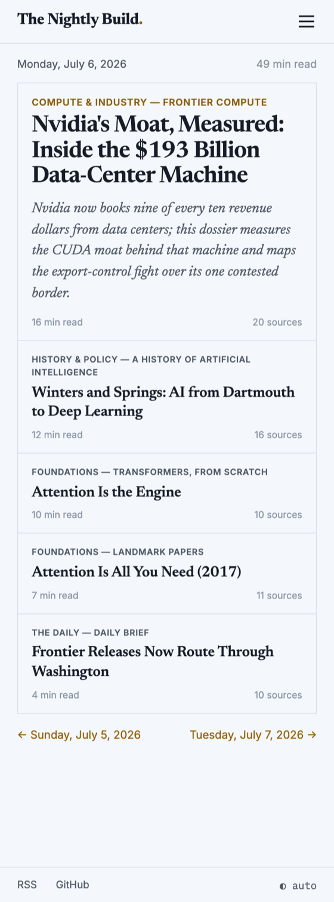
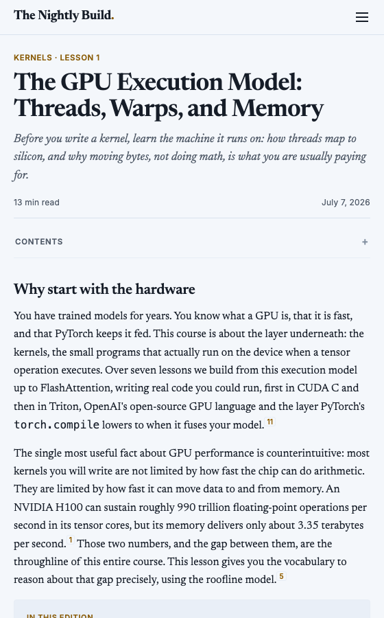

# The Nightly Build


The Nightly Build is an engine for running a personal, AI-researched
newspaper. You fork this repository, describe what you want to read, and a
scheduled agent researches and publishes cited articles to your own GitHub
Pages site every night. Git is the entire protocol: any agent that can open
a pull request can be your night shift.

Articles are original research artifacts, not summaries: each is a deeply
researched, fully cited piece, shaped to fit its topic. You describe what you
want covered and how deep to go; the night shift does the research, holds the
sourcing and quality bar, and publishes. Over weeks the output accumulates into
a permanent, searchable library that you own and that GitHub serves for free.

## What it looks like

One clean column, a ruled index, and every card carrying its reading time and
source count. The reader's front page and a single article, on a phone:

<p>


</p>

## Quickstart

1. Fork this repository (keep GitHub's "Copy the main branch only" box
   checked). Keep it public if you want the published site: GitHub Pages needs
   a public repo on the free plan.
2. Clone your fork and tell your agent "set me up", or run `./setup.sh` and
   edit `press/` by hand. Setup scaffolds your configuration, creates the
   `library` branch, and enables Pages and auto-merge. Enable workflows once
   in your fork's Actions tab. A complete working configuration ships in
   `examples/` to copy from.
3. Rehearse. Ask your agent for a "press check": a full research run
   rendered to a locally served site, with no PR, so you can tune prompts
   before scheduling anything.
4. Connect and schedule. Pick a path in [docs/scheduling.md](docs/scheduling.md):
   a provider's native scheduler (Claude Routines and Jules Scheduled Tasks are
   included in a plan you may already pay for) or the universal GitHub Actions
   cron that runs any headless agent. Schedule one nightly job for the whole
   paper and trigger it once now for today's first article. Each run derives its
   work list from the repo, so you never touch the schedule again.
5. Read. The night shift opens one PR per series, CI validates and (for
   `autopublish` series, which the examples enable) merges, the site rebuilds,
   and the morning email or Atom feed delivers it.

## How it works

| Piece         | Where                  | Purpose                                                                                                                              |
| ------------- | ---------------------- | ------------------------------------------------------------------------------------------------------------------------------------ |
| `PROTOCOL.md` | main                   | The complete agent contract                                                                                                          |
| the proof     | `engine/check.py`      | Validates articles. BLOCK findings stop publication; WARN findings drive revision                                                    |
| the editor    | `check.yml`            | Validates every PR to `library`; auto-merges clean ones from `autopublish` series (otherwise a human merges); supersedes competitors |
| the press     | `engine/build_site.py` | Rebuilds the site on every merge: front page, night archive, sections, search, feeds, email digests                                  |
| the paperboy  | `morning-mail.yml`     | Optional daily email of the latest build                                                                                             |
| duty          | `engine/duty.py`       | Deterministic nightly work selection: cadence, pauses, completion, commissions                                                       |
| templates     | `templates/`           | Two citation geometries plus a shared furniture catalog. User templates in `press/templates/` are first class                        |
| skills        | `skills/`              | Librarian (setup and curation) and Correspondent (the night shift runtime)                                                           |

Two branches with disjoint jobs: `main` holds the engine and your
configuration, `library` holds published articles, which the press builds into
the live Pages site on each merge.
`press/` is the only directory you edit. It does not exist upstream, so
pulling engine updates is an ordinary merge with nothing to conflict.

## Configuration

Series live in `press/series/<id>/` as a `series.yaml` plus a prompt file.
Four modes: `collection` (an item list, published front to back or at
random), `sequence` (an ordered course), `rolling` (one article per date),
and `open` (you describe a beat, the agent picks each night's topic and
genre). Cadence, pausing, sections, source requirements, and quality bands
are one-line settings. See [docs/series.md](docs/series.md).

Sources can be constrained per series: `required_docs` are committed files
the agent must read and cite, `consult` lists must-read starting points, and
`sources_exclusive: true` restricts citations to the declared set. The proof
enforces all three.

## Security

No executable logic ever lives on the `library` branch. Articles are
sandboxed: no scripts beyond JSON data blocks and the engine runtime, no
iframes, no event handlers, and external references only to the engine
assets path and Google Fonts. The editor validates untrusted PRs with
read-only permissions and no secrets. Auto-merge is squash-only, into
`library` only, for BLOCK-clean PRs only. Mail credentials exist only as
Actions secrets on the trusted post-merge path.

Anyone can open a pull request to a public site, but no stranger can publish
through one. The editor runs on the `pull_request` event, so a PR from a fork
receives a read-only token and cannot merge itself; only a branch pushed to the
site's own repository (the night shift, holding that repository's token) opens
a same-repo PR that auto-merge can act on. The guarantee is the token split
between fork and same-repo PRs, not article validation, so the trigger is
`pull_request` and never `pull_request_target`, and a test enforces that so it
cannot silently regress.

A site may load libraries to power its furniture (a syntax highlighter, say)
by declaring them in `press/site.yaml`. That surface preserves the boundary:
the list is owner-authored on `main`, never by an auto-merged article; every
entry is version-pinned and Subresource-Integrity-hashed; and articles stay
script-free, so the sandbox above is unchanged. See
[docs/customization.md](docs/customization.md).

## Development

The engine is Python 3.10+ with one runtime dependency, PyYAML. Scripts carry
PEP 723 metadata, so `uv run engine/check.py` works without any setup.

```sh
python3 engine/tests/run_tests.py    # proof, builder, and end-to-end suites
python3 engine/validate_config.py    # validate press/ configuration
```

Engine changes go through a lint, type-check, format, and test gate that CI
enforces on `main`. Set it up once:

```sh
uv sync                     # Python tools: ruff, ty
npm install                 # web tools: prettier, eslint, stylelint, markdownlint
uv run pre-commit install   # run the same checks on every commit
```

`pre-commit` runs exactly what CI runs (the Rust drop-in `prek` reads the same
config). The shell hooks also need `shellcheck` and `shfmt` on your PATH;
install them from your package manager.

This repository is engine-only. It runs no site and publishes no library;
the maintainer dogfoods by copying it like any other user. `examples/`
contains a complete working configuration as documentation.

## Docs

- [Your site: ownership, forks, updates](docs/press.md)
- [Series: modes, open sections, cadence, commissioning](docs/series.md)
- [Scheduling: native schedulers, the universal Actions cron, costs](docs/scheduling.md)
- [Customization: themes, voice, your own templates](docs/customization.md)
- [Delivery: feeds, morning email, the directory, the catalog API](docs/delivery.md)

Published sites are listed automatically on
[the-nightly-build.github.io](https://the-nightly-build.github.io/), a shared
front page over every paper (set `network.publish: false` to opt out). See
[docs/delivery.md](docs/delivery.md).

MIT licensed. No accounts, no backend, no analytics. `catalog.json` and the
Atom feeds are the API.
