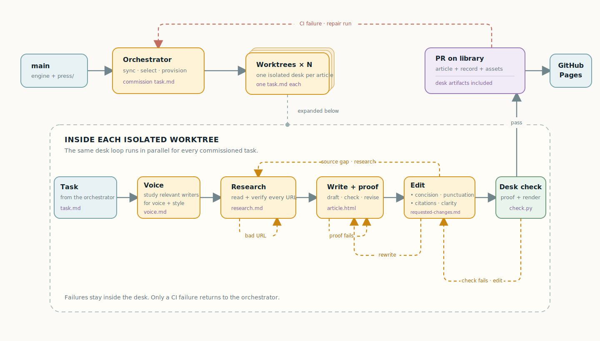

# The Nightly Build


## Your own AI-researched morning paper, published while you sleep

The Nightly Build turns a GitHub repository into a personal newspaper. Describe
what you want to read, connect an agent, and get original, cited articles on
your own GitHub Pages site every morning.

**No backend and no new accounts. It works with your existing AI subscriptions!**

Your paper and its archive live in your fork. You own it.

> [!NOTE]
> Your articles will be searchable from [this website](https://the-nightly-build.github.io/).
> Disable this via setting `directory.publish = false` in your `site.yaml`

## How it works



The orchestrator syncs `main`, reads `press/`, chooses what is due, and gives
each article its own task and Git worktree. Those desks run in parallel.

Inside a desk, the voice pass studies relevant writers before reporting begins.
Researchers read every source before recording it. The writer runs the proof;
the editor checks the prose and evidence, then routes changes back through the
writer. Failures stay in that desk until its final check passes.

A passing desk opens a PR against `library`. The PR contains the article, its
assets, and the production record. CI repeats the checks. Green publishes to
GitHub Pages; red sends the work back to the orchestrator.

`main` owns the engine and your configuration. `library` owns the published
paper. [The FAQ](#faq) covers accuracy, access, cost, and privacy.

## Get started

### 1. Fork and bootstrap

Fork this repository with **Copy the main branch only** enabled. Keep the fork
public if you want to use GitHub Pages on the free plan.

Clone the fork and run the setup script (or ask your agent to do this in the next step):

```sh
git clone https://github.com/<you>/<your-paper>.git
cd <your-paper>
./setup.sh
```

The script scaffolds `press/`, creates the empty `library` branch, seeds its
workflows, and configures GitHub Pages and auto-merge. It requires `git`,
`gh` (authenticated), Python 3.10+, and PyYAML.

### 2. Configure your paper

Ask your agent to **set me up**, or copy a starting point from [`examples/`](examples/README.md).
Your paper lives in one small configuration tree:

```text
press/
├── site.yaml                 # title and appearance
├── editorial.md              # paper-wide voice
└── series/<id>/
    ├── series.yaml           # cadence and publishing rules
    └── prompt.md             # what this section covers
```

See [Your paper](docs/press.md) and [Series](docs/series.md) for the full
configuration model.

### 3. Rehearse once

Ask your agent for a **press check**. It runs the article workflow locally,
builds a preview, and lets you tune your paper before anything is published.
This is useful for getting a feel for your prompts as well as the HTML components
that come with the repo and/or your own custom ones, which you can read about in
[Customization](docs/customization.md).

### 4. Schedule the night shift

Ask your agent to help you schedule the night shift. You'll need to make sure
it is set up with wider internet access permissions and the ability to raise
a PR in your repository.

The run derives its work from `press/`, so you do not need to update the schedule
when you add or pause a section. The automation only needs to be updated if the
[automation prompt](docs/scheduling.md#the-schedule-prompt) changes.

Choose a provider schedule or the universal GitHub Actions path in
[Scheduling](docs/scheduling.md). [Harnesses](docs/harnesses.md) lists the
supported agents and how their usage is billed.

### 5. Read your paper

The night shift opens pull requests against `library`. Once the first article
merges, GitHub Pages publishes the newsstand, archive, search index, and feeds.
See [Delivery](docs/delivery.md) for the URLs and feed formats.

## Make it yours

- Change the title and appearance in `press/site.yaml`.
- Set the paper-wide voice in `press/editorial.md`.
- Add sections, beats, cadence, and source requirements under `press/series/`.
- Customize themes, furniture, and templates in `press/`.

The [examples](examples/README.md) are a living reference. [Customization](docs/customization.md)
covers the extension points without requiring engine changes.

For contributors and engine maintainers, start with [PROTOCOL.md](PROTOCOL.md) and
[Updating the engine](docs/press.md#updating-the-engine).

## FAQ

<!-- markdownlint-disable MD033 -->

<details>
<summary><strong>How do you keep the writing from sounding like AI?</strong></summary>

<p>Voice is set before drafting. Research, writing, and editing are separate
jobs. The editor cuts repetition, fixes rhythm and punctuation, checks
citations, and can send the piece back.</p>

</details>

<details>
<summary><strong>Can it still hallucinate?</strong></summary>

<p>Yes. The workflow reduces that risk; it cannot remove it. Research happens
before drafting, every recorded URL must be read, and the editor traces claims
back to sources. The proof and CI enforce citation structure and source rules.
Claims without enough evidence should be cut.</p>

</details>

<details>
<summary><strong>What can the night shift access?</strong></summary>

<p>Only what you grant it. A normal run needs the web, both repository branches,
and permission to open a PR against <code>library</code>. CI is read-only and
does not receive the scheduler's secrets. See <a href="docs/scheduling.md">Scheduling</a>.</p>

</details>

<details>
<summary><strong>Can it read paywalled or authenticated sources?</strong></summary>

<p>Not as a built-in, portable feature yet. That work is tracked in
<a href="https://github.com/the-nightly-build/the-nightly-build/issues/127">issue #127</a>.
Credentials must stay outside the repository, and the system will not bypass
access controls.</p>

</details>

<details>
<summary><strong>Why does every article use a pull request?</strong></summary>

<p>The PR is both the review record and the publishing gate. It carries the
article, earned assets, production record, and validation result. Nothing
reaches <code>library</code> without passing CI.</p>

</details>

<details>
<summary><strong>What does it cost?</strong></summary>

<p>The Nightly Build has no hosted service or fee. You pay for the agent or model
runner you choose. More articles, broader research, and longer drafts use more
tokens. See <a href="docs/harnesses.md">Harnesses</a>.</p>

</details>

<details>
<summary><strong>Can I keep my paper private?</strong></summary>

<p>Yes, if your GitHub plan supports Pages for private repositories. A public
fork is the simplest free setup.</p>

</details>

<details>
<summary><strong>Can I change the engine?</strong></summary>

<p>Yes. Most changes belong in <code>press/</code>; start with
<a href="docs/customization.md">Customization</a>. If you modify the engine
itself, you also own any conflicts when syncing upstream updates.</p>

</details>

<!-- markdownlint-enable MD033 -->
