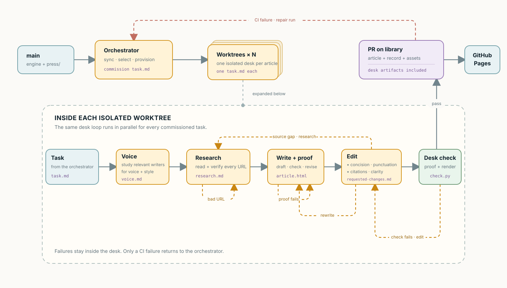

# Architecture

The diagram begins after the engine has decided what work is due and ends when
GitHub Pages serves the result. It shows the central split in the system: agents
make editorial judgments, while repository-owned code controls the publication
boundary.

## Before the diagram

The owner defines the press on `main`; published articles live on `library`. At
the start of a scheduled run, `nb duty` compares those two states and returns
the exact authorized work. The orchestrator may make editorial choices within
that result, but it cannot expand it.

That deterministic entrypoint keeps cadence and rerun safety out of model
judgment. [Schedule publication](../guides/operate/schedule.md) documents the
runtime, and [Ownership and branches](ownership-and-branches.md) documents the
state split.

## The orchestrator coordinates, and roles decide

The orchestrator plans the edition together, then creates one isolated workspace
per article. Isolation keeps sources, instructions, and drafts from leaking
between articles and lets independent work proceed in parallel. It is an
execution detail, not a different publication path: a runtime without child
agents preserves the same role sequence and records.

The orchestrator chooses the commission; the engine assembles its governing
context from the current repository revision. Roles consume those named files
directly instead of relying on an orchestrator's paraphrase.

Within an article, each role owns one kind of judgment. The return arrows in the
diagram are ownership boundaries: voice questions return to the writing coach,
evidence gaps to the researcher, and to the writer both the reporting the editor
cannot do and a redraft when the piece needs rewriting past what editing
reaches. The editor edits prose, structure, and furniture directly. The
orchestrator routes those requests instead of silently resolving them in a
shared context.

The writing coach is the one role a run may skip. A series that pins a standing
voice guide has already made the judgment the coach exists to make, so the
engine supplies that guide and production starts at research. Skipping it is a
cost decision the press owner makes, never a waived gate: the article carries
the same coach record either way, and the writer and editor read it as they read
any other.

Every invocation saves its exact input and output. Later repairs append to that
record rather than replacing it, so the submitted article carries the history
that produced it.

## The engine makes judgment enforceable

The CLI beside the article flow is not another editorial role. It owns
repeatable operations: assembling context, validating work, creating permitted
assets, previewing the real page, and preparing the exact pull-request shape.
Agents decide what to say; the engine checks whether the result satisfies the
press and publication contracts.

Local checks shorten the repair loop. They do not grant publication authority.

## The Article PR is the boundary

After editor approval, `nb prepare-pr` turns one workspace into one proposed
publication commit. CI evaluates that untrusted article with the trusted engine
from `main` and without scheduler secrets. A failure returns to the owning role,
a valid new article merges and triggers a static Pages build.

Manual articles enter at the orchestrator, skipping only the schedule decision.
Revisions use the same validation boundary but require human review.

[Publishing and security](publishing-and-security.md) defines the complete trust
model. [Ownership and branches](ownership-and-branches.md) explains where the
press, engine, production records, and generated site live.
